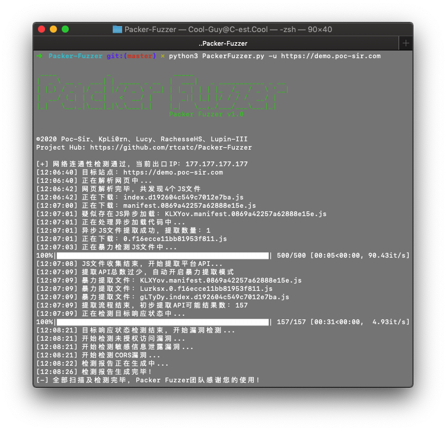

<h1 align="center" >Packer Fuzzer</h1>

<h3 align="center" >A scanning tool for fast and efficient security detection of websites constructed by front-end packaging tools such as Webpack</h3>

 <p align="center">
    <a href="https://github.com/rtcatc/Packer-Fuzzer"></a>
    <a href="https://github.com/rtcatc/Packer-Fuzzer"></a>
    <a href="https://github.com/rtcatc/Packer-Fuzzer"></a>
    <a href="https://github.com/rtcatc/Packer-Fuzzer"></a>
    <a href="https://github.com/rtcatc/Packer-Fuzzer"></a>
    <h5 align="center">Proudly produced by Poc-Sir, KpLi0rn, Liucy, RachesseHS, Lupin-III</h5>
    <h5 align="center" ><a href="../../README.md">Click here for the Chinese version</a></h5>
 </p>


 <p align="center">
    
 </p>


## 👮🏻‍♀️ Disclaimer

**Any direct or indirect consequences and losses** caused by the dissemination and use of the detection function provided by the Packer Fuzzer tool (hereinafter referred to as this tool) shall be the responsibility of the user. The Packer Fuzzer development team (hereinafter referred to as the team) **No responsibility for this**.

This tool will **automatically generate** a scan result report based on the user's detection results. The content of this report and other derivative content **cannot represent** the position and views of the team.

Please follow the **relevant laws and regulations** of the user and the country where the target system is located when using this tool. All **unauthorized tests are not allowed**. In the event of related illegal acts, we will **reserve** the right to pursue **your legal responsibility, and fully cooperate** with relevant agencies to initiate investigations.


## 🏝 What is it?

With the popularity of web front-end packaging tools, have you encountered more and more websites represented by `Webpack packager` in daily penetration testing and security services? This type of packager will package the API and API parameters of the entire site together for centralized Web call, which is also convenient for us to quickly discover the functions and API lists of the website, but often the number of JS files generated by these packagers is unusually large and total The amount of JS code is extremely large (more than ten thousand lines), which brings great inconvenience to our manual testing, and the Packer Fuzzer software came into being.

This tool supports automatic fuzzy extraction of the API corresponding to the target site and the parameter content corresponding to the API, and supports the fuzzing and efficient fuzzing of seven vulnerabilities: unauthorized access, sensitive information leakage, CORS, SQL injection, unauthorized access, weak password, and arbitrary file upload Rapid detection. After the scan is over, this tool also supports automatic generation of scan reports. You can choose the HTML version that is easy to analyze and the more formal doc, pdf, txt versions.

And you don’t have to worry about language problems caused by internationalization. This tool comes with five major language packages (including report templates): Simplified Chinese, French, Spanish, English, and Japanese (sorted according to translation accuracy). ~~No~~Professional team translation.

> Note: Currently the first version of the tool only optimizes the rules of the Webpack packager, please look forward to other packager rules.


## 🎸 Installation environment

1. This tool is developed in Python3 language. Before running this tool, please make sure you have the `Python3.X` software and the `pip3` software installed. If you have not installed the relevant environment, you can install it through the following instructions: [https://www.runoob.com/python3/python3-install.html](https://www.runoob.com/python3/python3-install.html )

   MacOS users can use the following command to quickly install:

   ```bash
   brew install python3 #will automatically install pip3
   ```

   Ubuntu users can use the following command to quickly install:

   ```bash
   sudo apt-get install -y python3 && sudo apt install -y python3-pip
   ```

   CentOS users can use the following command to quickly install:

   ```bash
   sudo yum -y install epel-release && sudo yum install python3 && yum install -y python3-setuptools && easy_install pip
   ```

2. This tool will run native `NodeJS` code through `node_vm2`, so we recommend that you install the `NodeJS` environment (other JS runtime environments are not recommended, which may cause parsing failure). If you have not installed the relevant environment, you can install it through the following instructions: [https://www.runoob.com/nodejs/nodejs-install-setup.html](https://www.runoob.com/nodejs/nodejs-install -setup.html)

   MacOS users can use the following command to quickly install:

   ```bash
   brew install node
   ```

   Ubuntu users can use the following command to quickly install:

   ```bash
   sudo apt-get install nodejs && sudo apt-get install npm
   ```

   CentOS users can use the following command to quickly install:

   ```bash
   sudo yum -y install nodejs
   ```

3. Use the following command to install the Python runtime library required by this tool with one click:

   ```bash
   pip3 install -r requirements.txt
   ```


## 🦁 Parameter introduction

You can use the `python3 PackerFuzzer.py [options]` command to run this tool. The content of `options` is as follows:

--h (--help)

  Help command, no additional parameters, view all the parameters supported by this tool and their corresponding introduction;

--u (--url)

  The URL path of the website to be scanned is a required option, for example: `-u https://demo.poc-sir.com`;

--c (--cookie)

  Additional cookies content, can be empty, if filled in, it will be passed globally, for example: `-c "POC=666;SIR=233"`;

--d (--head)

  Additional HTTP header content, which can be empty, if filled in, it will be passed in globally, the default is `Cache-Control:no-cache`, for example: `-d "Token:3VHJ32HF0"`;

--l (--lang)

  Language option, when it is empty, the system will automatically select the corresponding language option, if there is no corresponding language pack, it will automatically switch to the English interface. The available language packs are: Simplified Chinese (zh), French (fr), Spanish (es), English (en), Japanese (ja), for example: `-l zh`;

--t (--type)

  It is divided into basic version and advanced version. When it is empty, the basic version is used by default. The advanced version will rescan all APIs and fuzzy extract the corresponding parameters of the API, and perform: SQL injection vulnerabilities, horizontal unauthorized vulnerabilities, weak password vulnerabilities, and arbitrary file upload vulnerabilities. You can use the `adv` option to enter the advanced version, for example: `-t adv`;

--p (--proxy)

  Global proxy, can be empty, if you fill in, use proxy IP globally, for example: `-p https://hack.cool:8080`;

--j (--js)

  Additional JS file, can be empty, when you think there are other JS files that need to be analyzed by this tool, you can use this option, for example: `-j https://demo.poc-sir.com/js/index.js, https://demo.poc-sir.com/js/vue.js`;

--b (--base)

  Specify the middle part of the API (for example, when an API is: https://demo.poc-sir.com/v1_api/login, its basedir is: v1_api), it can be empty, when you think the automatically extracted basedir of this tool is not accurate , You can use this option, for example: `-b v1_api`;

--r (--report)

  Specify the report format to be generated. When it is empty, HTML and DOC format reports are generated by default. Available report formats are: html, doc, pdf, txt, for example: `-r html,pdf`;

--e (--ext)

  Whether to enable the extension plug-in option, this tool supports users to self-write plug-ins and save them in the `ext` directory (for how to write, please refer to the `demo.py` file in the corresponding directory). The default is off. When the user uses the `on` command to open, the tool will automatically execute the plug-ins in the corresponding directory, for example: `-e on`;

--f (--flag)

  The SSL connection security option, when it is empty, is closed by default. In this state, all insecure connections will be blocked. If you want to ignore the SSL security status, you can use the `1` command to enable it, and all certificate errors will be ignored, for example: `-f 1`;

-s (--silent)

  The Silent option, once enabled, all operations that ask for YES or NO will automatically be set to YES, and the content after the parameter is the name of the scan report (custom report name), which can be used for unattended, batch operations, plug-in calls, for example: `-s Scan_Task_777`.

--st (--sendtype)

  Request method option. Currently, this option supports POST and GET parameters. Once enabled, all APIs will be scanned using the corresponding request method. If not enabled, an intelligent request will be made through the HTTP status code.

--ct (--contenttype)

  Content-Type option, you can use this option to customize the content of the Content-Type parameter in the HTTP request header during scanning. If it is not enabled, the intelligent request will be made through the HTTP status code.

--pd (--postdata)

  POST content option, you can use this option to customize the POST request content during scanning (all scans will use this content, only valid for POST scenarios).

--ah (--apihost)

  Api domain name option, you can use this option to customize the domain name of all API requests during scanning, for example: the api part (the API path extracted from JS) is `/v1/info`, the scanned url (-u --url parameter The incoming content, the scanned webpage) is `http://exp.com/`, when the apihost parameter is passed in `https://pocsir.com:777/`, the API at this time is `https://pocsir.com:777/v1/info` instead of `http://exp.com/v1/info`, for scenarios such as api and front-end different domain names or servers.

--fe (--fileext)

  Api extension option, you can use this option to add a specific extension to all APIs to deal with the situation that the extension extraction is missing when extracting the API, for example: when the extracted API is `https://pocsir.com:777/v1/info`, pass in `--fe .json`, the tool will automatically convert the API to `https://pocsir.com:777/v1/info.json` for scanning and detection.


## 🎯 Use skills

- When you encounter a fake stuck or the scanner is interrupted due to an unexpected error, you don't need to worry too much. You can directly find the Sqlite database file ending with `.db` in the corresponding cache folder in the tmp directory. When you open it, you can see that all real-time results of the corresponding project are saved in this database, and you can directly use the cache Database analysis of current scan results;
- We recommend that you increase the success rate of API splicing and reduce the number of packages sent by customizing `baseurl`. It is not difficult to find `baseurl`, you only need to trigger any API in the corresponding target site and observe the missing part to find it quickly;
- We do not recommend that you use the advanced mode of this tool on larger and more complex sites, because in some cases the advanced mode will consume an unusually large amount of time to constantly perform regular matching in the background, thus making the tool fall into a fake card Dead state;
- When you encounter that the APIs of site A are in site B: you can directly use the `--ah (--apihost)` command of this tool to customize the API server address;
- When you are unable to create and read the database under Windows environment, you can right-click on `Run as administrator`. Please also pay attention to permission issues when you are under Linux/Mac. It is recommended to use the `sudo` command.


## 📝 Opinion exchange

You can submit ISSUE directly in the Github warehouse: [https://github.com/rtcatc/Packer-Fuzzer/issues](https://github.com/rtcatc/Packer-Fuzzer/issues)

If you think the specific goal should not be disclosed directly, you can send us an email: admin[at]hackinn.com

When submitting, in order to facilitate our judgment, please attach the corresponding log file in the `logs` directory. Thank you for your cooperation!


## 🍻 Contribution list

 <p>
    <a href="https://github.com/rtcatc">&nbsp; Poc Sir</a>
   &nbsp;&nbsp;&nbsp;&nbsp;&nbsp;
    <a href="https://github.com/KpLi0rn">&nbsp;KpLi0rn </a>
   &nbsp;&nbsp;&nbsp;&nbsp;&nbsp;
    <a href="https://github.com/Liucyer">&nbsp;Liucy</a>
   &nbsp;&nbsp;&nbsp;&nbsp;&nbsp;
    <a href="https://github.com/RachesseHS">&nbsp;RachesseHS</a>
 </p>


## 👑 Updated records

- v1.0 30/09/2020

  1. We created it.

- v1.1 21/11/2020

  1. Fixed some compatibility issues in Windows system;

  2. Improve the part of global certificate validation that is ignored;

  3. Fixed several bugs that could cause serious errors in the scanner.

- v1.2 2021/01/21

  1. Add front-end packager recognition function and asset tree display function;

  2. Optimized the asynchronous extraction rules and added two types of API identification rules;

  3. Fixed the bug that the report and database could not be generated correctly;

  4. Added silent mode, which is convenient for batch testing or multi-platform linkage;

  5. Urgently fix a vulnerability that may cause arbitrary command execution.

- v1.3 2021/04/23

  1. Fixed several bugs that may cause abnormal detection;

  2. Replace PyExecJS with relatively safe node_vm2;

  3. Optimized the terminal display interface and added new interactive prompts;

  4. Optimize the processing mode of BaseDir to make it more user-friendly.

- v1.4 2022/06/19

  1. Fixed several bugs that would cause the scanner to run abnormally;

  2. Remove the deprecated python extension content;

  3. Optimized the HTML report, now it can display the content length returned by the API, and can be sorted;

  4. Added POST and GET request switching mechanism;

  5. Added the custom function of Content-Type request header;

  6. Added data content customization function during POST request;

  7. Added the function of customizing the Api server address.
